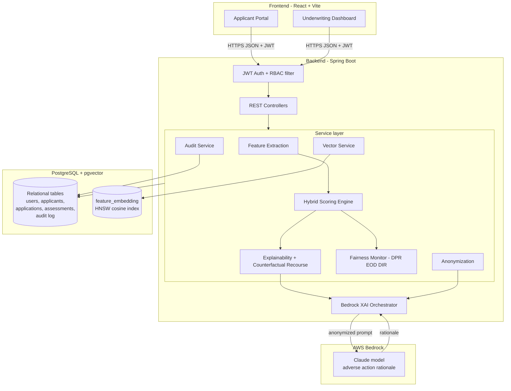

# Synchrony Dynamic Risk Assessment

AI-powered financial inclusion for underserved segments. This prototype scores
thin-file and unbanked applicants using alternative data, explains every
decision in plain language and writes an immutable audit trail for compliance.

Conventional scorecards treat the absence of a credit file as high risk, so
millions of creditworthy people are shut out. This system reads mobile money
behavior, utility payment history, telecom activity, behavioral signals and
transaction network structure, then blends them with any traditional bureau
data into one calibrated score on the Synchrony 300 to 850 band.

---

## What it does

- **Applicant Portal.** Applicants link alternative data streams and run a
  dynamic evaluation. They see the decision, the score, the main drivers and, if
  declined, the exact steps that move them toward approval.
- **Underwriting Dashboard.** Credit officers review risk profiles, transparent
  feature attribution, model weighting, fair lending metrics, similar historical
  cases and a manual override control.
- **Explainable by construction.** The model is an additive scorecard, so each
  feature contribution is an exact SHAP value. The AI layer turns those numbers
  into an adverse action rationale that meets ECOA and Regulation B.
- **Fair and private.** Protected attributes never enter scoring. They are used
  only for post-hoc fairness monitoring. PII is anonymized before any data
  reaches the LLM layer.

---

## Architecture



**Applicant lifecycle:** link data, extract features, score, assess fairness,
compute recourse for declines, generate the rationale, store the embedding and
write the audit record. Every step is persisted so any decision can be replayed.

---

## Tech stack

| Layer | Technology |
| --- | --- |
| Frontend | React 18, Vite, React Router, Axios |
| Backend | Java 21, Spring Boot 3.3, Spring Security, Spring Data JPA |
| Database | PostgreSQL 16 with the pgvector extension (HNSW index) |
| AI | AWS Bedrock runtime with a deterministic fallback |
| Auth | JWT bearer tokens, BCrypt, Role-Based Access Control |
| Tests | JUnit 5, AssertJ, Spring Security Test, H2 |

---

## Repository layout

```
Synchrony/
  backend/                 Spring Boot service
    src/main/java/com/synchrony/inclusion/
      ai/                  Bedrock client, XAI orchestrator, response parser
      config/              Security, CORS, data seeder
      controller/          REST endpoints
      domain/              JPA entities and enums
      dto/                 Request and response records
      repository/          Spring Data repositories
      scoring/             Feature catalog, hybrid model types
      security/            JWT service and filter
      service/             Feature extraction, scoring, explainability, fairness
    src/main/resources/db/schema.sql   Canonical migration with pgvector
    src/test/java/         Unit and context tests
  frontend/                React applicant portal and underwriting dashboard
  docker-compose.yml       pgvector database plus optional full stack
  PRESENTATION.md          Synchrony-branded slide content
  .env.example             Environment template
```

---

## How the model works

### Hybrid score

Features are grouped into three buckets: traditional bureau data, alternative
telemetry and graph network signals. The unified logit is

```
z        = intercept + sum_i  gamma * w_bucket(i) * baseWeight_i * (x_i - baseline_i)
p_good   = sigmoid(z)
score    = 300 + 550 * p_good
PD       = 1 - p_good
```

Every feature is normalized so 1.0 is the most favorable and 0.0 the least. When
an applicant has no bureau data the traditional weight drops to zero and the
alternative and network weights are renormalized to sum to one. This is the
dynamic imputation path for unbanked applicants.

### Explainability and recourse

Because the model is additive, each feature contribution is exactly
`weight * (value - baseline)`, which is the SHAP value for a linear model. The
dashboard shows these as diverging bars. For a decline the engine solves a
counterfactual: the minimal, feasible feature changes that reach the approval
logit, ranked by Max Percentile Shift cost. Immutable features are held fixed.

### Adverse action rationale

The Bedrock orchestrator receives the anonymized decision, the top drivers and
the recourse steps, then returns a plain-language rationale and principal
reasons. If Bedrock is disabled or unreachable the same structured output is
produced by a deterministic template, so a decision never blocks on model
availability.

### Fairness

The fairness monitor computes the Disparate Impact Ratio, the Demographic Parity
Ratio and the Equal Opportunity Difference across monitored groups and flags any
value below the four fifths rule. This runs after decisions and never influences
an individual outcome.

### Privacy and audit

Sensitive keys and PII patterns are stripped before any LLM call. Every action
writes an append-only audit record with a SHA-256 fingerprint of the payload, so
auditors can reproduce and verify any historical decision.

---

## API reference

| Method | Path | Role | Purpose |
| --- | --- | --- | --- |
| POST | /api/auth/register | public | Create an applicant account |
| POST | /api/auth/login | public | Authenticate and receive a JWT |
| GET | /api/auth/me | any | Current user profile |
| POST | /api/applications | applicant | Create a credit application |
| GET | /api/applications | applicant | List own applications |
| POST | /api/applications/{id}/data | applicant | Link one alternative data stream |
| POST | /api/applications/{id}/evaluate | applicant | Run the dynamic evaluation |
| GET | /api/applications/{id}/assessment | applicant | Latest decision for an application |
| GET | /api/underwriting/queue | officer | Applicant queue with risk profiles |
| GET | /api/underwriting/applications/{id} | officer | Full profile, attribution, similar cases |
| POST | /api/underwriting/applications/{id}/override | officer | Manual override with reason |
| GET | /api/underwriting/fairness | officer | Fair lending metrics |
| GET | /api/audit | officer | Immutable audit trail |
| GET | /api/meta/features | any | Feature catalog |
| GET | /api/meta/status | any | Bedrock and pgvector runtime status |

---

## Quick start

With Docker installed, one command builds and runs everything, waits for the
backend and verifies a demo login:

```bash
./run.sh
```

Then open **http://localhost:8081** (in a Codespace, open the forwarded port
8081). Sign in with `officer` / `Officer#2024` or `maria` / `Applicant#2024`.
Stop with `docker compose down` (add `-v` to reset the database).

The rest of this section covers the manual setup and running the pieces locally.

## Local setup

### Prerequisites

- Java 21 and Maven 3.9
- Node 20 or later
- Docker (for the pgvector database)

### 1. Configure the environment

```bash
cp .env.example .env
# set JWT_SECRET, for example:
echo "JWT_SECRET=$(openssl rand -base64 48)" >> .env
```

### 2. Start the database

```bash
docker compose up -d db
```

This starts PostgreSQL with pgvector and applies `schema.sql` on first run. If
you cannot use Docker, point the backend at any PostgreSQL 15+ instance that has
the pgvector extension installed. Without pgvector the service still runs and
falls back to in-application similarity search.

### 3. Run the backend

```bash
cd backend
JWT_SECRET="$(grep JWT_SECRET ../.env | cut -d= -f2-)" \
DB_URL=jdbc:postgresql://localhost:5432/synchrony \
DB_USERNAME=synchrony DB_PASSWORD=synchrony \
mvn spring-boot:run
```

The API starts on http://localhost:8080. On first run it seeds a credit officer
and eight demo applicants with evaluated decisions.

### 4. Run the frontend

```bash
cd frontend
npm install
npm run dev
```

Open http://localhost:5173. The dev server proxies API calls to the backend.

### Full stack in containers

```bash
docker compose up -d --build
```

Run detached (`-d`) so the stack keeps running after the command returns. If you
run it in the foreground, pressing Ctrl+C stops every container. Frontend on
http://localhost:8081, backend on http://localhost:8080, database on 5432.
Requires JWT_SECRET in your .env file. Follow startup with
`docker compose logs -f backend` and wait for `Started InclusionApplication`.

---

## Demo logins

| Role | Username | Password |
| --- | --- | --- |
| Credit Officer | officer | Officer#2024 |
| Applicant | maria (and aisha, diego, james, priya, chen, sofia, omar) | Applicant#2024 |

Passwords are local demo defaults. Set SEED_OFFICER_PASSWORD and
SEED_APPLICANT_PASSWORD for any shared environment.

### Suggested walkthrough

1. Sign in as an applicant, create an application, link a few data streams then
   run the dynamic underwriting. Read the decision, drivers and recourse.
2. Sign in as the officer. Open an applicant in the queue. Inspect the model
   weighting, the feature attribution, the similar cases and the rationale.
3. Apply a manual override with a reason, then open the audit trail to see the
   append-only record.

---

## Testing

```bash
cd backend
mvn test
```

The suite covers feature conversion, the hybrid scoring math, counterfactual
recourse, the fairness metrics, PII anonymization, AI response parsing and a
full Spring context load.

```bash
cd frontend
npm run build
```

---

## Configuration reference

| Variable | Default | Description |
| --- | --- | --- |
| JWT_SECRET | none, required | HS256 signing secret, 32 bytes or more |
| JWT_EXPIRATION_MINUTES | 120 | Access token lifetime |
| DB_URL | jdbc:postgresql://localhost:5432/synchrony | JDBC URL |
| DB_USERNAME / DB_PASSWORD | synchrony | Database credentials |
| CORS_ALLOWED_ORIGINS | http://localhost:5173 | Allowed browser origins |
| BEDROCK_ENABLED | false | Turn on the Bedrock rationale generator |
| AWS_REGION | us-east-1 | Bedrock region |
| BEDROCK_MODEL_ID | anthropic.claude-3-5-sonnet-20240620-v1:0 | Model id |
| SCORING_APPROVE_THRESHOLD | 640 | Approve at or above this score |
| SCORING_DECLINE_THRESHOLD | 580 | Decline below this score, refer in between |
| SEED_ENABLED | true | Seed demo data on an empty database |

No credentials are hardcoded. The JWT secret and all cloud access come from the
environment. AWS access uses the standard credential chain when Bedrock is on.

---

## Security and compliance notes

- Role-Based Access Control on both the URL and the method layer.
- Stateless JWT authentication with BCrypt password hashing.
- Protected attributes are excluded from every feature vector.
- PII anonymization before LLM processing.
- Append-only audit log with payload hashing for full decision lineage.
- Fair lending metrics with an automatic four fifths rule flag.
